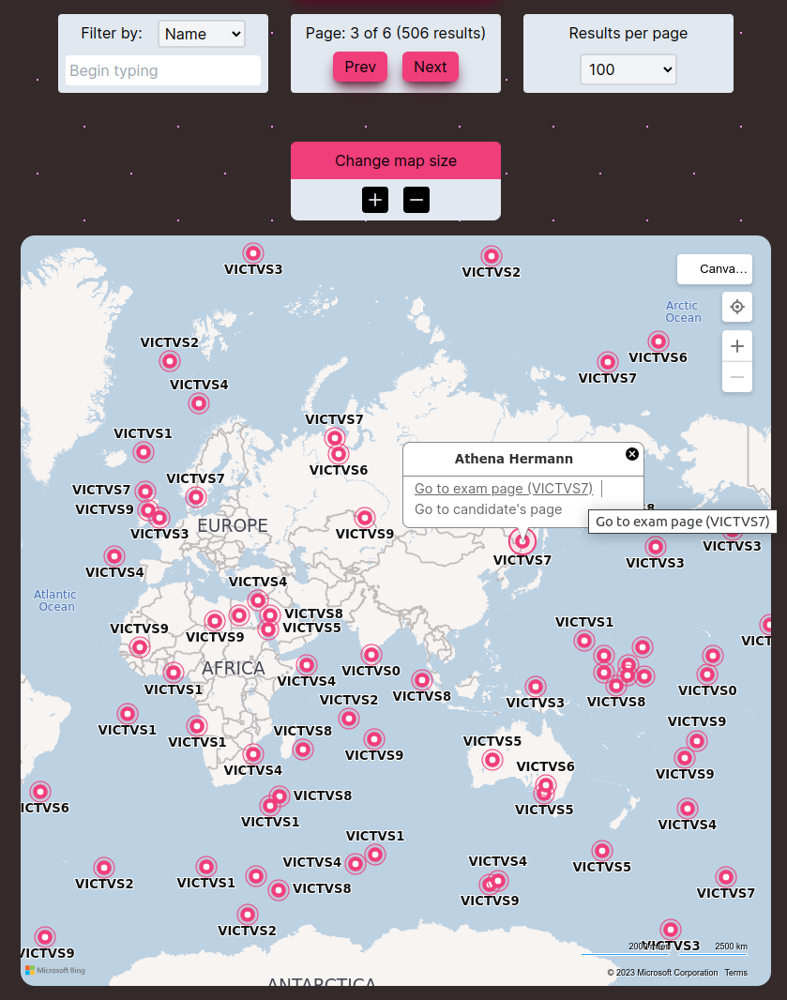
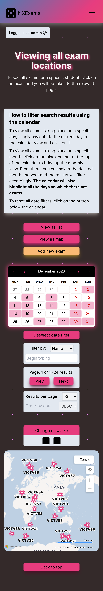

# Interactive front-end app with Next.js and Tailwind CSS

**[Click this link to go to the live app](https://next13-app-alpha.vercel.app/)**

Welcome to this Next13 CRUD application! Let's first talk about how to get started.

<br></br>

<br></br>

## Quick start instructions
1) Sign up for a new account at [this link](https://next13-app-alpha.vercel.app/signup).
    - To access all of the application's features, you'll need an admin account. For demonstration purposes, sign up with an email ending with **@v3.admin** to get admin access.
2) Login in with your email and password.
3) On the 'Exams' page, you can toggle between list/map view, filter, paginate and sort.
4) On the 'Exams' page, you can higlight exam days by clicking on the black banner at the top of the calendar and selecting a specific month.

Now let's dive into the main features of this project.

## Key product features

- Mobile-first design that thoroughly implements responsive design principles.
- Utility-based styling with Tailwind CSS.
- Interactive UI provides the user with feedback regarding loading, confirmation and error states.
- State synchronisation across multiple views.
- Leverages back end and front end form validation.
- Leverages back-end authentication and authorization features through request headers, allowing users to sign up and log in.
- Implements dynamic filtering and pagination with multiple active queries.
- Includes a calendar that highlights active dates and allows users to filter results by day/month.
- Uses extensive data fetching and customised error handling via promises.
- Uses context APIs within Next13's client components to enable access to centralised states.
- Uses several new features realeased in Next 13 such as the App router (a file-based routing system) and custom loading/404/error pages.
- Production build deployed on Vercel's serverless platform.


## Running the project in your local environment.

First, ensure that you have the latest versions of Node.js and npm (or yarn/pnpm) installed on your local machine.

1) Fork and clone the repository.
2) cd into the repository and install project dependencies:
```bash
npm install
# or
yarn install
# or
pnpm install
```

3) Run this command to start the development server:

```bash
npm run dev
# or
yarn dev
# or
pnpm dev
```

4) Open [http://localhost:3000](http://localhost:3000) with your browser to see the result.
5) You can edit the application by modifying any of the functional components located in ./app and the webpage auto-updates as you edit the file.

### Accessing the Bing Maps API
To use the maps API in your local environment, you will need your own private key.

1) Head over to the Bing maps Dev Center (https://www.bingmapsportal.com/) where you can create an account and create a new basic API key. Copy this key to your clipboard.
2) Create a ```.env``` file in the root of the repository and add a variable named API_KEY. Assign the API key to this variable.

```sh
# Example: add your API key to your .env file
        API_KEY=dsfiubSADFbdsnb765394=mvkjyusQWdsbignsbdxtu6554fsck
```
3) Run this CLI command to load the API key into *process.env*:
```bash
        npm run loadenv
```

And that's all you have to do! You should now have access to the Bing Maps API and eveyrthing should work correctly.


## Main libraries used for this project
Library | Purpose
--- | ---
Next | React framework
Bing Maps - React | Based on Microsoft's Bing Maps V8 Web Control
Tailwind CSS | Styling
React-Calendar | Date visualisation and filtering
Axios | API requests


## Screeenshots
The exams page contains a map which shows a live view of exams which can be filtered and paginated. Hovering over each pin on the map reveals an infobox with the name of the candidate and the exam, as well as links to the exam page and the rest of that candidate's exams.

<sub><sup>(Never mind that some of those exams are taking place right in the middle of an ocean - the longitude/latitude data was generated automatically!)



Mobile view:



